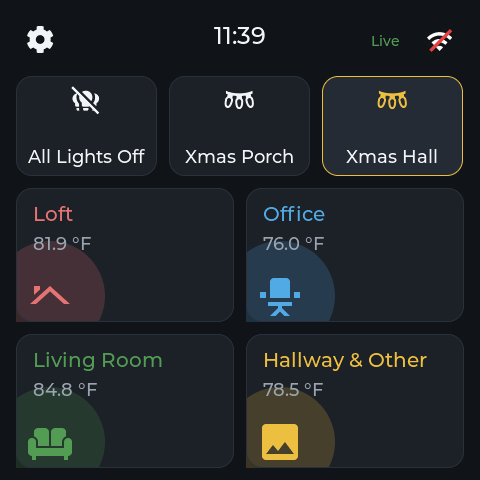
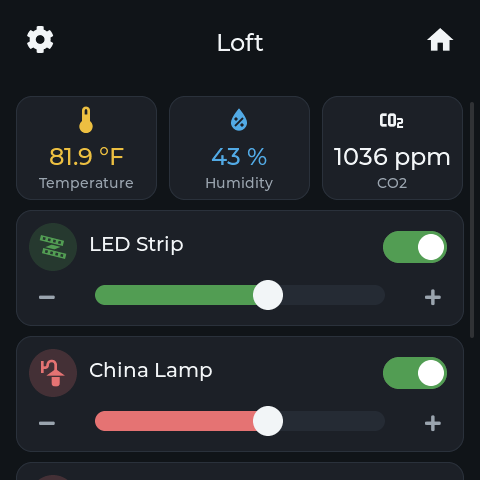
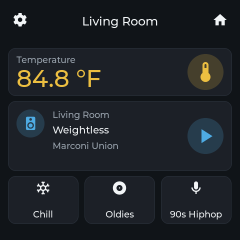
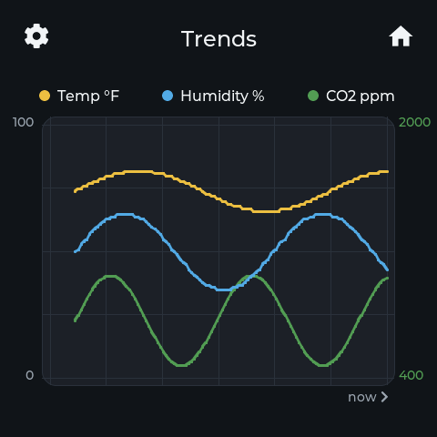
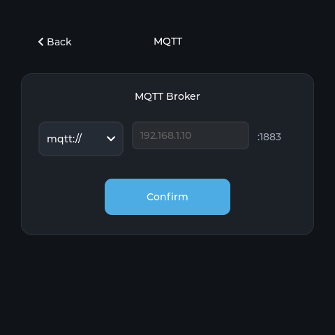
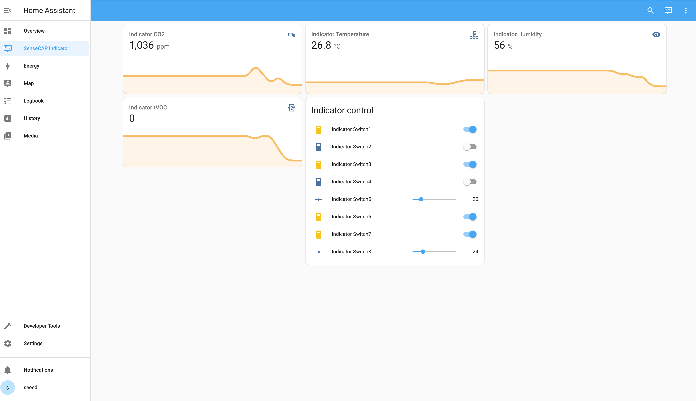
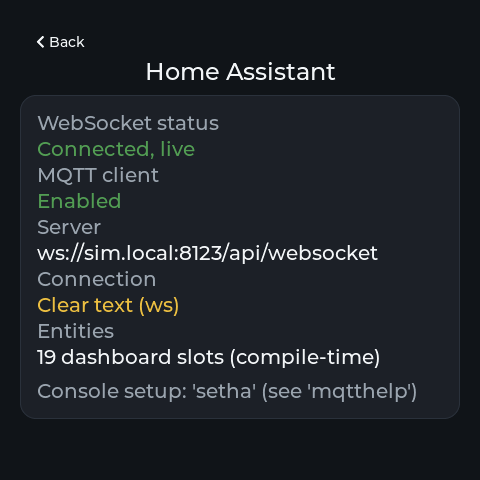

# SenseCAP Indicator — Home Assistant Firmware

[](https://github.com/skywalkw3r/sensecap-indicator-ha/actions/workflows/ci.yml)

Firmware that turns the [Seeed Studio SenseCAP Indicator](https://www.seeedstudio.com/SenseCAP-Indicator-D1-p-5643.html) into a Home Assistant companion panel. It joins your Wi-Fi and talks to Home Assistant over your choice of two transports — classic **MQTT** (switch entities driven both ways, display values pushed by an automation, buzzer as a siren entity) or HA's native **WebSocket API** (the panel subscribes to entities directly; no broker or automation needed for live values). Touch controls, live temperature/humidity/CO₂ tiles, and a rolling Trends chart render on the 480×480 panel. All connections are outbound from the device; it opens no network ports.

<table>
  <tr>
    <td align="center"><br/><sub><b>Home</b> — clock, quick actions, room cards</sub></td>
    <td align="center"><br/><sub><b>Loft</b> — environment tiles + light controls</sub></td>
  </tr>
  <tr>
    <td align="center"><br/><sub><b>Living Room</b> — media player + playlist presets</sub></td>
    <td align="center"><br/><sub><b>Trends</b> — rolling temperature / humidity / CO₂</sub></td>
  </tr>
</table>

---

## Table of Contents

- [Features](#features)
- [Quick Start](#quick-start)
- [Architecture](#architecture)
- [Talking to Home Assistant](#talking-to-home-assistant)
- [Home Assistant Setup](#home-assistant-setup)
- [Build & Flash](#build--flash)
- [Console Commands](#console-commands)
- [Configuration](#configuration)
- [Development](#development)
- [Version](#version)

---

## Features

**On-screen**

- Home-Assistant-style dashboard: a Home page (quick-action chips + a 2×2 grid of room cards with live temperatures) and one swipeable page per room — tap a room card or swipe to navigate
- Room pages render from a compile-time table ([`main/dashboard_config.h`](main/dashboard_config.h)): hero temperature, stat rows, switches, a light card with brightness slider, a media-player card with playlist preset chips
- Material Design Icons subset baked in (`scripts/gen_mdi_font.py`), accent-tinted per room
- Trends history chart (last 120 samples per series) on the final page
- Settings modal: Wi-Fi, Display (brightness/sleep), MQTT broker, and a live Home Assistant WebSocket status card

**Home Assistant integration**

- [x] Home Assistant WebSocket API client — subscribes to every dashboard entity with a long-lived access token and calls HA services (`light.turn_on`, `script.turn_on`, `media_player.media_play_pause`, …) straight from the panel; two-way state sync, no broker or automation YAML
- [x] MQTT client — display values via `indicator/display/set` (read-only fallback when WebSocket is off), sensor publishing on Grove-equipped variants (the base D1 has none, so that pipeline idles). The old `switch1..8` topic bridge was deliberately retired in favour of WebSocket service calls
- [x] Buzzer exposed as an HA MQTT siren entity (`beep`/`doorbell`/`alarm` tones, console-testable via `beep`)
- [x] One-at-a-time transport toggle (`setha --enable` ⇄ `setha --disable` / `setmqtt --enable`)
- [x] Optional TLS for both transports (`mqtts://`, `wss://`): CA provisioning over serial, public CA bundle fallback, explicit insecure opt-out
- [ ] REST API

**Configuration & operations**

- Wi-Fi and MQTT broker setup from the touchscreen; everything (including WebSocket and TLS) from the serial console
- NVS-backed persistence for Wi-Fi credentials, MQTT config, WebSocket config
- Dashboard rooms/entities are compile-time (`main/dashboard_config.h`, gitignored — auto-created from `dashboard_config.example.h`) — fill in your entity ids once, rebuild, flash
- No compiled-in connection defaults: an unconfigured device stays idle and never phones home

**Development**

- PC simulator (SDL2) for iterating on the UI without flashing hardware
- `./dev` wrapper for build/flash/monitor on both MCUs

---

## Quick Start

**Prerequisites:** ESP-IDF v5.4.x installed with `IDF_PATH` exported in your shell (see [ESP-IDF setup](https://docs.espressif.com/projects/esp-idf/en/v5.4/esp32s3/get-started/)).

```bash
git clone <this-repo>
cd sensecap-indicator-ha
./dev build && ./dev flash
./dev monitor          # Ctrl-] to exit
```

After flashing, configure Wi-Fi from the touchscreen, then pick a transport in [Home Assistant Setup](#home-assistant-setup): MQTT broker (touchscreen or `setmqtt`) or native WebSocket (`setha`). Everything can be driven from the serial console — see [Console Commands](#console-commands).

---

## Architecture

The SenseCAP Indicator is a dual-MCU device:

| MCU | Role | Key resources |
|-----|------|---------------|
| **ESP32-S3** | Display, touch, Wi-Fi, MQTT + WebSocket clients, Home Assistant logic | 8 MB flash, PSRAM @ 120 MHz OCT mode, 240 MHz CPU |
| **RP2040** | Sensor acquisition on Grove ports, buzzer | Reads CO₂, tVOC, temperature, humidity; relays to ESP32-S3 over UART |

The two chips communicate over a COBS-framed UART link. All Grove sensor and buzzer access goes through the RP2040; the ESP32-S3 never touches that hardware directly. On the base D1 (no bundled Grove sensors) the link carries only buzzer commands, and the on-screen temperature/humidity/CO₂ come from Home Assistant instead.

```
┌─────────────────────────────────────────────────────┐
│                     ESP32-S3                         │
│                                                      │
│  ┌──────────┐   ESP event   ┌──────────┐            │
│  │  Model   │◄─────loop────►│   View   │            │
│  │ (state,  │               │ (LVGL,   │            │
│  │  NVS,    │               │  touch   │            │
│  │  MQTT,   │               │  input)  │            │
│  │  WS)     │               │          │            │
│  └────┬─────┘               └──────────┘            │
│       │ UART / COBS                                  │
└───────┼─────────────────────────────────────────────┘
        │
┌───────┼─────────────────────────────────────────────┐
│       ▼          RP2040                              │
│  Packet dispatch                                     │
│  ┌────────────┐  ┌────────────┐  ┌────────────┐    │
│  │   SCD41    │  │   SGP40    │  │   SHT41    │    │
│  │   (CO₂)    │  │   (tVOC)   │  │ (temp/hum) │    │
│  └────────────┘  └────────────┘  └────────────┘    │
└─────────────────────────────────────────────────────┘
```

### Model / View pattern

Each application domain has a paired `*_model.c` and `*_view.c`:

- **Model** — owns state, NVS reads/writes, MQTT/WebSocket traffic, RP2040 packet parsing
- **View** — owns LVGL object updates, touch callbacks, screen transitions

Model and view communicate exclusively through the **ESP event loop** with typed event IDs and payloads defined in `main/view_data.h`. Neither side calls the other's functions directly.

For per-domain locations and architecture rules, see [`AGENTS.md`](AGENTS.md); the HA domain has its own map in [`main/ha/README.md`](main/ha/README.md).

---

## Talking to Home Assistant

The device speaks two transports and runs **one at a time**:

| Transport | Carries | Needs on the HA side |
|-----------|---------|----------------------|
| **WebSocket** (the dashboard's transport) | Every dashboard entity both ways: live states in, service calls out | Nothing but a long-lived access token |
| **MQTT** (read-only fallback) | Loft display values, siren, sensor publishing | Broker + MQTT integration (+ an automation for display values) |

`setha --enable` switches to WebSocket (the MQTT client stops); `setha --disable` or `setmqtt --enable` switches back — the dashboard then degrades to read-only Loft values + Trends, and its controls are inert. The Settings → *Home Asst* card always shows which side is active.

### MQTT topics

| Direction | Topic | Example payload |
|-----------|-------|-----------------|
| Device → HA (sensors) | `indicator/sensor` | `{"temp":"23.5","humidity":"45","co2":"450","tvoc":"100"}` |
| HA → Device (display values) | `indicator/display/set` | `{"loft_temp":72.4,"loft_humidity":45,"loft_co2":620}` |
| HA → Device (buzzer siren) | `indicator/siren/set` | `{"state":"ON","tone":"alarm","duration":15}` — or bare `ON`/`OFF` |
| Device → HA (siren state) | `indicator/siren/state` | `{"state":"ON","tone":"alarm"}` / `{"state":"OFF"}` |

The legacy `indicator/switch/set` / `indicator/switch/state` bridge (8 numbered
switch slots + one HA automation per entity) was retired: dashboard controls
now call HA services directly over the WebSocket, which also pushes true entity
state back to the panel (toggling from the HA app updates the panel instantly).

**Siren tones:** `beep` (single chirp, default), `doorbell` (double chirp), `alarm`
(repeating chirp for `duration` seconds — default 10, max 120; stop early with
`OFF`). The buzzer lives on the RP2040, so sounds are short 50 ms chirps
sequenced over the inter-chip UART link.

**Sensor keys:** `temp`, `humidity`, `co2`, `tvoc`

### WebSocket

The device connects out to `ws(s)://<ha>:8123/api/websocket`, authenticates with a long-lived token, and issues one `subscribe_entities` covering every subscribable dashboard slot (`main/dashboard_config.h`). Home Assistant pushes an initial snapshot and then every state change instantly; media players additionally carry `media_title`/`media_artist` through attribute diffs. Slots flagged with a legacy display index keep feeding the Trends history exactly like the MQTT path, so the chart doesn't care which transport is active — and while WebSocket is enabled, `indicator/display/set` is ignored so the history is never double-fed.

Controls go the other way as `call_service` frames — toggles use `homeassistant.turn_on/turn_off`, the brightness slider `light.turn_on` with `brightness_pct`, presets and *All Lights Off* run scripts, the media card `media_player.media_play_pause`. The panel paints optimistically and the subscription echo reconciles the true state.

---

## Home Assistant Setup

### Option A — MQTT

1. **Install an MQTT broker** (Mosquitto is the simplest) and enable the MQTT integration in Home Assistant.

2. **Point the Indicator at the broker** — from the device's MQTT screen, or via [`setmqtt`](#console-commands) over serial. The device ships with **no default broker**; until you set one it stays idle. Once Wi-Fi has an IP address and a broker is configured, the client connects within seconds — internet access is not required, so isolated IoT VLANs work fine.

3. **Add MQTT entities.** Append [`examples/homeassistant/mqtt-entities.yaml`](examples/homeassistant/mqtt-entities.yaml) to your `configuration.yaml` under the `mqtt:` key, then reload MQTT.

4. **Add the dashboard.** Paste [`examples/homeassistant/dashboard.yaml`](examples/homeassistant/dashboard.yaml) into the Lovelace Raw Configuration Editor.

<table>
  <tr>
    <td align="center" width="38%"><br/><sub>On-device MQTT broker setup (step 2)</sub></td>
    <td align="center" width="62%"><br/><sub>The example Lovelace dashboard in Home Assistant (step 4)</sub></td>
  </tr>
</table>

See also: [Seeed wiki — Home Assistant application guide](https://wiki.seeedstudio.com/SenseCAP_Indicator_Application_Home_Assistant/).

### Option B — native WebSocket (no broker needed for live values)

1. **Mint a token** in Home Assistant: Profile → Security → *Long-lived access tokens* → Create token.

2. **Fill in your entities** — the first build copies [`main/dashboard_config.example.h`](main/dashboard_config.example.h) to `main/dashboard_config.h` (gitignored, so your home's entity ids never land in the repo). Edit that copy's room/slot tables with your real ids, then rebuild + flash. Rooms, icons, accent colours, switches, the light, media player and preset scripts all live in that one file.

3. **Configure the connection over the serial console** (fields merge into the stored config, so this can be split across commands):

   ```text
   setha -a 192.168.1.10 -t <long-lived-token>
   setha --enable
   ```

4. **Check it**: `haconfig` prints the WebSocket block, and the Settings → *Home Asst* card on the touchscreen shows live connection status. `setha --disable` switches back to MQTT.

<p align="center"><br/><sub>The Settings → Home Asst status card, live over WebSocket</sub></p>

Addresses accept bare IPs and hostnames (`192.168.1.10`, `ha.local:8123` → `ws://…:8123`) or TLS URLs (`wss://ha.example.com`, `https://xyz.ui.nabu.casa` → `wss://…:443`); `wss://` uses the same trust settings as `mqtts://` (see [TLS](#tls-mqtts-and-wss)).

---

## Build & Flash

### ESP32-S3 (main firmware)

**Prerequisites:** ESP-IDF v5.4.x with `IDF_PATH` exported.

```bash
./dev build          # idf.py build
./dev flash          # auto-detects port
./dev monitor        # Ctrl-] to exit
./dev fullclean      # reset build directory
```

Manual `idf.py` works the same way:

```bash
. "$IDF_PATH/export.sh"
idf.py build
idf.py -p /dev/ttyUSB0 -b 460800 flash monitor
```

**Critical `sdkconfig.defaults` settings — do not remove:**

- `CONFIG_LV_USE_CLIB_MALLOC=y` — required; LVGL 9 must allocate from the ESP heap (PSRAM). Its built-in 64 KB TLSF pool cannot hold composite-layer draw buffers, and a failed layer allocation live-locks the render task (UI freeze + task_wdt). The old `CONFIG_LV_MEM_CUSTOM=y` was an LVGL 8 option and has no effect on LVGL 9.
- PSRAM clock: 120 MHz OCT mode
- CPU: 240 MHz, flash: QIO 120 MHz

App partition is 7 MB (`partitions.csv`); total flash is 8 MB.

### RP2040 (sensor coprocessor)

Only needed when changing sensor protocols. Current version is **v2.1.0**. Built with PlatformIO (Arduino core by Earle Philhower).

```bash
./dev rp2040 build
./dev rp2040 upload      # device must appear as /dev/cu.usbmodem*
./dev rp2040 monitor
```

---

## Console Commands

Connect at the device's baud rate and use these commands:

| Command | Description |
|---------|-------------|
| `mqtthelp` | Print setup examples for both transports, topics, and payloads |
| `haconfig` | Print the current MQTT + WebSocket configuration |
| `setmqtt -a <addr>` | Set broker address (e.g., `mqtt://192.168.1.10:1883`) |
| `setmqtt -a <addr> -c <client-id> -u <user> -p <pass>` | Full broker configuration |
| `setmqtt --enable` / `--disable` | Turn the MQTT client on (stops WebSocket) / off |
| `setha -a <addr> -t <token>` | Set the HA WebSocket address + access token (dashboard entities are compile-time: `main/dashboard_config.h`) |
| `setha --enable` / `--disable` | Switch to WebSocket / back to MQTT (one transport at a time) |
| `beep [-t <tone>] [-d <seconds>]` / `beep --off` | Sound the buzzer locally (same engine as the MQTT siren) |

**Examples:**

```text
setmqtt -a 192.168.1.10 -c indicator-01 -u mqtt_user -p mqtt_password
setmqtt --addr mqtt://192.168.1.10:1883
setha -a 192.168.1.10 -t eyJhbGciOi... --temp sensor.loft_temperature --enable
```

After `setmqtt`/`setha` succeeds, the configuration is saved to NVS and the affected client restarts automatically.

### TLS (`mqtts://` and `wss://`)

Use an `mqtts://` broker URL (port defaults to 8883) or a `wss://` WebSocket URL to encrypt the connection. Both ride on the same stored trust settings:

| Command | Description |
|---------|-------------|
| `setmqtt -a mqtts://<host>[:port] ...` | TLS broker; server certificate is verified |
| `setha -a wss://<host>[:port]` | TLS WebSocket to Home Assistant |
| `setmqttca` | Paste a CA certificate PEM over the console; stored in NVS and used to verify the server |
| `setmqttca -c` | Clear the stored CA (falls back to the built-in public CA bundle) |
| `setmqtt --insecure` / `--secure` | Skip / re-enable server verification (skipping is discouraged) |

Verification order: stored CA if present, otherwise the public CA bundle (for endpoints with real certificates — Nabu Casa, Let's Encrypt reverse proxies). LAN endpoints with a self-signed or private-CA certificate need `setmqttca` — a self-signed server certificate can be pasted directly as its own trust anchor. The touchscreen MQTT page stays plaintext-only (`mqtt://`).

**With Home Assistant's Mosquitto add-on:** set `certfile`/`keyfile`/`cafile` in the add-on configuration to expose a TLS listener on 8883 (HA and other local clients can keep using 1883 internally), then paste your CA cert into `setmqttca` and point `setmqtt` at `mqtts://<HA-host>:8883`.

### Security notes

Wi-Fi and MQTT credentials — and the Home Assistant long-lived access token — are stored in plaintext in NVS, and the serial console is unauthenticated: anyone with physical or USB access can read them back. Use a dedicated MQTT user with a limited ACL so a leaked credential can't reach the rest of your broker, and prefer the WebSocket token where you can — it is revocable at any time from the HA profile page. Before reselling or disposing of the device, run `idf.py erase-flash` to wipe stored credentials.

---

## Configuration

Run `idf.py menuconfig` to explore options. Notable locations:

- **LVGL fonts** — `Component config → LVGL configuration → Font usage`
- **PSRAM clock** — `Components → ESP PSRAM → SPI RAM config` (requires "Make experimental features visible")

To regenerate `sdkconfig` from defaults: delete it and run `./dev build`.

**No compiled-in endpoints** — a fresh device is unconfigured and stays idle until you set a broker (touchscreen or `setmqtt`) or a WebSocket target (`setha`). All config is stored in NVS; if a stored blob is ever unreadable or the wrong size (e.g. after a struct change), the device treats itself as unconfigured rather than falling back to any default. Clients (re)start automatically whenever Wi-Fi obtains an IP and on every config save; internet reachability is never required.

---

## Development

**Code completion.** Install [clangd](https://github.com/clangd/clangd/releases) and the [clangd VS Code extension](https://marketplace.visualstudio.com/items?itemName=llvm-vs-code-extensions.vscode-clangd). After one successful build, `build/compile_commands.json` is generated and clangd uses it automatically for ESP-IDF-aware navigation.

**PC simulator.** The `sim/` directory builds a desktop version of the UI using LVGL's SDL2 backend (macOS, 480×480 window matching the real LCD). Useful for iterating on screens, fonts, and layouts without flashing. Model/network code is stubbed; only the view layer compiles.

```bash
cmake -S sim -B sim/build && cmake --build sim/build -j4
./sim/build/sensecap_sim
```

Headless helpers (environment variables): `SIM_SCREENSHOT=<path.bmp>` captures a frame and exits (`SIM_SCREENSHOT_LAYER=top` for modals), `SIM_START_TILE=<n>` jumps to a page, and `SIM_OPEN_SETTINGS=1` / `SIM_OPEN_BROKER=1` / `SIM_OPEN_HA_WS=1` open the corresponding modal through the real event path.

**Architecture rules.** See [`AGENTS.md`](AGENTS.md) for module locations, boot sequence, and the model/view boundary rules that contributors (human and AI) must follow.

---

## Version

| Component | Version |
|-----------|---------|
| Firmware (ESP32-S3) | `v1.1.0` + unreleased `main` |
| Coprocessor (RP2040) | `v2.1.0` |
| ESP-IDF | `v5.4.x` |
| LVGL | `v9.x` (managed component) |
| RP2040 build system | PlatformIO |

<details>
<summary>Changelog</summary>

| Version | Notes |
|---------|-------|
| Unreleased (`main`) | Native Home Assistant WebSocket API client with one-at-a-time MQTT/WebSocket transport toggle and a live status card in Settings; optional TLS for MQTT (`mqtts://`) and WebSocket (`wss://`) with serial CA provisioning; buzzer exposed as an MQTT siren entity |
| `v1.1.0` | Upgraded to ESP-IDF 5.4.x and LVGL 9; added `mqtthelp` console command; improved MQTT setup UX; unified build/flash tooling into `./dev` |
| `v1.0.0` | Initial release (ESP-IDF 5.1 era, LVGL 8) |

</details>
